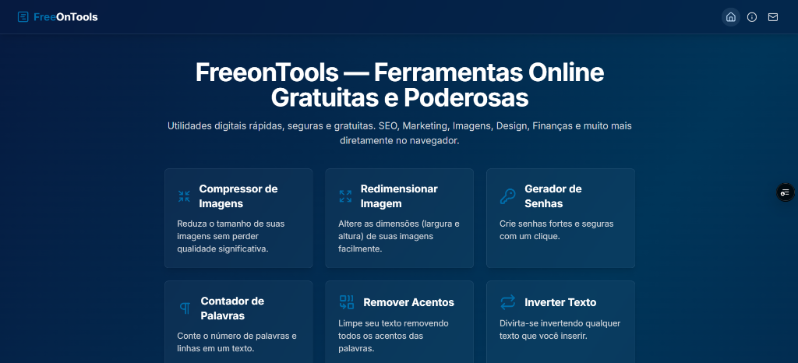

# FreeOnTools - Ferramentas Online Gratuitas



# FreeonTools — Ferramentas Online Gratuitas e Poderosas

FreeonTools é um portal completo de ferramentas online grátis projetado para ajudar qualquer pessoa — de profissionais a estudantes, de desenvolvedores a criadores de conteúdo — a resolver tarefas do dia a dia sem instalar software ou criar contas. Todas as ferramentas estão disponíveis diretamente no navegador, com uso rápido, intuitivo e sem custos ocultos.

## 🚀 O Que é o FreeonTools

O FreeonTools oferece uma coleção abrangente de utilitários digitais gratuitos que facilitam desde tarefas simples até processos mais avançados. A proposta é eliminar a necessidade de programas pesados e licenciamentos caros, entregando soluções rápidas e práticas em um só lugar.

## 🛠️ Principais Categorias de Ferramentas

### 📈 SEO e Marketing Digital
Otimize sua presença online sem complicação. Criação de Meta Tags, Sitemap, Tags Open Graph, UTM Links e Análise de Palavras-Chave.

### ✍️ Texto e Conteúdo
Otimize, edite e transforme textos com facilidade: Contadores de Palavras, Geradores de Lorem Ipsum, Parafrasear e Converter Texto em Áudio.

### 🎨 Imagem & Design
Edite e transforme imagens de maneira intuitiva: Redimensionador, Compressor, Conversores de Formato e Extração de Paleta de Cores.

### 💼 Financeiras & Utilitários de Cálculo
Facilitam decisões financeiras e cálculos do cotidiano: Conversores de Moeda, Calculadoras de Juros e Descontos, IMC e Datas.

### 🎉 Entretenimento & Diversão
Geradores de Piadas, Citações, Nome de Times ou Personagens. Porque produtividade também pode ser divertida.

### 👨‍💻 Ferramentas para Desenvolvedores
Formatadores e Minificadores de Código (JSON, HTML, CSS), Encoders/Decoders, Testadores de Hash e Utilitários de API.

## 📌 Por Que Usar o FreeonTools?
- **Totalmente Gratuito:** Sem taxas, assinaturas ou limitações ocultas.
- **Sem Instalação:** Funciona diretamente no navegador em qualquer dispositivo.
- **Sem Contas ou Registro:** Comece a usar agora, sem e-mails ou senhas.
- **Versátil e Completo:** Uma plataforma única para tarefas variadas.

## 🚀 Quem Pode Usar
- Profissionais de SEO e marketing digital.
- Designers, criadores de conteúdo e social media.
- Desenvolvedores, programadores e estudantes de TI.
- Estudantes, professores e curiosos em geral.
- Empreendedores e gestores.

## 📍 Conclusão
O FreeonTools é uma solução prática e gratuita para propósito geral. Ele concentra ferramentas úteis que ajudam a agilizar tarefas, economizar tempo e melhorar resultados, sem custos e sem barreiras.

---

## 🛠️ Tecnologias Utilizadas

Este projeto foi construído com o que há de mais moderno no ecossistema Web:

- **React 19**: Biblioteca UI para interfaces reativas.
- **Vite**: Build tool extremamente rápido.
- **Tailwind CSS**: Estilização moderna e responsiva.
- **Lucide React**: Biblioteca de ícones elegantes.
- **React Router Dom (v7)**: Gerenciamento de rotas e navegação.
- **TypeScript**: Tipagem estática para robustez do código.

---

## 📁 Estrutura do Projeto

```bash
├── components/     # Componentes reutilizáveis (Layout, Cards, etc.)
├── pages/          # Páginas principais (Home, Sobre, Contato, etc.)
├── tools/          # Implementação individual de cada ferramenta
├── constants.ts    # Definição e metadados das ferramentas
├── App.tsx         # Configuração de rotas e estrutura global
└── index.tsx       # Ponto de entrada da aplicação
```

---

## 🔒 Segurança e Privacidade

Diferente de outros sites, o **FreeOnTools** preza pela sua segurança:
- **Zero Servidor**: Seus arquivos e textos nunca saem do seu computador.
- **Privacidade**: Não armazenamos dados de uso ou arquivos enviados.
- **Velocidade**: Processamento instantâneo via Client-Side.

---

## 💻 Como Executar Localmente

1. **Clonar o repositório**:
   ```bash
   git clone https://github.com/Wilian96/FreeOnTools.git
   ```

2. **Instalar dependências**:
   ```bash
   npm install
   ```

3. **Iniciar o servidor de desenvolvimento**:
   ```bash
   npm run dev
   ```

---

## 📄 Licença

Este projeto está sob a licença MIT. Veja o arquivo [LICENSE](LICENSE) para mais detalhes.
